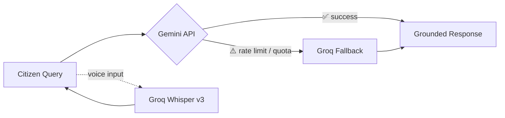

<div align="center">

# 🇮🇳 NagrikAI

### The AI-Powered Civic Companion for Smart Bharat

**Transparency · Accessibility · Digital Inclusion — for every Indian citizen**

Built for the **"Smart Bharat – AI-Powered Civic Companion"** hackathon challenge

**Next.js 16 · TypeScript · Tailwind CSS 4 · Google Gemini API · Groq Whisper v3 · MIT Licensed**

*Ask a question. File a complaint. Dodge a scam. All in five Indian languages, in one app.*

</div>

<br>

<div align="center">

### 🏆 Why judges keep coming back to this one

| 🛡️ Scam Shield | 🧾 Document Vision OCR | 🗣️ Voice-First AI | 🔐 DPDP-Native Privacy |
|:---:|:---:|:---:|:---:|
| Detects fraud impersonating govt schemes | Flags issues in Aadhaar/PAN uploads | Groq Whisper speech-to-text | Zero Aadhaar storage, ever |

</div>

---

## 📋 Table of Contents

- [Challenge Alignment](#-challenge-statement-alignment)
- [What NagrikAI Does](#-what-nagrikai-does)
- [Tech Stack](#-tech-stack)
- [Quick Start](#-quick-start)
- [Project Structure](#-project-structure)
- [Prompt Engineering & AI Architecture](#-prompt-engineering--ai-architecture)
- [Feature Walkthrough](#-feature-walkthrough)
- [Design Language](#-design-language)
- [Honest Limitations](#️-honest-limitations-for-judges)
- [License](#-license)

---

## 🎯 Challenge Statement Alignment

<div align="center">

| Challenge Requirement | NagrikAI Feature | Status |
|---|---|:---:|
| Simplify complex government information | AI Chat Companion, grounded in a verified dataset | ✅ |
| Answer citizen queries | Multi-turn conversational AI with voice input (Groq Whisper) | ✅ |
| Recommend relevant public services | Personalized Scheme Finder — demographic-based matching | ✅ |
| Assist with document requirements | AI Document Analyzer — Vision OCR with issue flagging | ✅ |
| Track complaints | Grievance Reporting with `NGK-XXXXXX` ticket IDs | ✅ |
| Provide multilingual support | 5 Indian languages — English, हिंदी, বাংলা, தமிழ், मराठी | ✅ |
| Promote transparency | Official `.gov.in` portals surfaced for every query | ✅ |
| Digital inclusion | Mobile-first UI, voice input, large touch targets | ✅ |

</div>

---

## 🇮🇳 What NagrikAI Does

NagrikAI is a multi-page **Next.js** web application built around six GenAI-powered capabilities that go far beyond a typical FAQ chatbot.

<table>
<tr><td width="26%"><b>💬 AI Chat Companion</b></td><td>Ask any question about government schemes in plain language. Get grounded answers in your own language, with <b>Groq Whisper STT</b> for accurate voice input.</td></tr>
<tr><td>🛡️ <b>Scam Shield</b> ⭐</td><td>Paste a suspicious message. NagrikAI cross-checks claimed fees against real fee structures and verifies URLs against official government domains to catch fraud in seconds.</td></tr>
<tr><td>🎯 <b>Personalized Scheme Finder</b> ⭐</td><td>Fill a simple demographic profile — state, age, category, income — and discover exactly which central and state schemes you qualify for.</td></tr>
<tr><td>📄 <b>AI Document Analyzer</b> ⭐</td><td>Upload a photo of an Aadhaar / PAN card. Vision AI checks completeness and readability and masks sensitive info for privacy.</td></tr>
<tr><td>📮 <b>Grievance Reporting & Smart Routing</b></td><td>Describe any public issue in your own words. AI classifies it and routes it to the correct state/national portal, issuing a trackable ticket.</td></tr>
<tr><td>🗂️ <b>Service Directory</b></td><td>Search and filter 20+ government services in a clean grid. Tap any card to instantly ask the AI Companion about it.</td></tr>
</table>

> **What sets it apart:** most civic-tech hackathon entries stop at a simple FAQ bot. NagrikAI **protects** citizens from fraud, **verifies** documents with Vision AI, and **personalizes** recommendations — three layers of value most teams don't attempt.

---

## 🛠 Tech Stack

<div align="center">

| Layer | Technology |
|---|---|
| **Framework** | Next.js 16 (App Router) + TypeScript, scaffolded with Google Antigravity |
| **Styling** | Tailwind CSS 4 · shadcn/ui · Lucide icons |
| **Primary LLM** | Google Gemini API — `gemini-2.5-flash`, `gemini-2.5-pro`, `gemini-1.5-flash` |
| **Fallback LLM + Voice** | Groq API — `llama-3.3-70b`, `mixtral-8x7b`, `whisper-large-v3` |
| **Database** | Prisma ORM + SQLite (grievance tracking) |
| **State** | Zustand (view + language persistence) |
| **Deploy Target** | Vercel / standalone Node.js server |

</div>

> **🔁 Self-Healing AI Chain** — if the Gemini API hits a rate limit or quota ceiling, the server automatically fails over to the corresponding Groq model in **under 2 seconds**, so the citizen never sees a broken response.



---

## 🚀 Quick Start

```bash
# 1. Install dependencies
bun install   # or npm install

# 2. Set up the database (SQLite, already configured)
bun run db:push

# 3. Run the dev server
bun run dev   # → http://localhost:3000

# 4. Lint
bun run lint
```

### 🔑 Environment Configuration

Create a `.env` file in the project root:

```env
DATABASE_URL=file:./db/custom.db
GEMINI_API_KEY=your_google_gemini_api_key
GROQ_API_KEY=your_groq_api_key
```

---

## 📁 Project Structure

```
src/
├── app/
│   ├── api/
│   │   ├── chat/route.ts          # AI Chat Companion endpoint
│   │   ├── stt/route.ts           # Speech-to-Text transcription (Groq Whisper v3)
│   │   ├── recommend/route.ts     # Personalized Scheme Recommender endpoint
│   │   ├── doc-analyze/route.ts   # Document analysis (Gemini Vision OCR)
│   │   ├── scam-check/route.ts    # Scam Shield endpoint (returns JSON verdict)
│   │   └── grievance/route.ts     # POST (classify+create) / GET (list tracker)
│   ├── chat/
│   ├── docs/                      # AI Document Analyzer page
│   ├── grievance/
│   ├── scam/
│   ├── schemes/                   # Personalized Scheme Finder page
│   ├── services/
│   ├── globals.css                # Custom OKLCH palette (instrument fonts)
│   ├── layout.tsx
│   └── page.tsx
├── components/
│   ├── ui/                        # shadcn/ui primitives
│   └── nagrik/
│       ├── header.tsx             # Nav bar + active language selector
│       ├── footer.tsx             # Responsive footer
│       ├── hero.tsx               # Landing page hero
│       ├── chat-companion.tsx     # Chat component + voice recorder
│       ├── scam-shield.tsx        # Scam detector UI
│       ├── grievance-report.tsx   # Complaint filing + live status tracker
│       ├── scheme-recommender.tsx # Personalized profile form & recommendations
│       ├── doc-analyzer.tsx       # Secure document Vision OCR checker
│       └── service-directory.tsx  # Categorized service grid
└── lib/
    ├── services-data.ts           # Service grounding dataset
    ├── prompts.ts                 # Heuristic system prompts
    ├── gemini.ts                  # Fetch client wrapper — Gemini → Groq fallback
    ├── store.ts                   # Zustand: view + language
    ├── types.ts                   # Shared API contracts
    └── db.ts                      # Prisma client
```

---

## 🧠 Prompt Engineering & AI Architecture

This is the heart of NagrikAI: **every AI feature is grounded in one structured dataset**, so responses stay accurate instead of hallucinating.

<details>
<summary><b>📚 (a) Grounded service reference data</b></summary>
<br>

`src/lib/services-data.ts` defines a typed dataset of **20 Indian government services** — Aadhaar, PAN, Voter ID, Ration Card, PM-Kisan, Ayushman Bharat, PM Awas Yojana, e-Shram, RTPS, EPF, Vahan/Sarathi, MGNREGA, PM Ujjwala, DigiLocker, RTI, PM Jan Dhan, NPS, Jeevan Pramaan, National Scholarship Portal, and more.

Each service carries:

- `name`, `category`, `nodalDepartment`
- `portal` — the **official URL** (ground truth for scam URL checks)
- `description` — one-liner
- `fee` — **Free / Nominal fee / Paid** (critical for Scam Shield)
- `feeDetail` — exact fee in ₹
- `documents` — Proof of Identity / Address / DOB / scheme-specific requirements

This dataset is serialized into a Markdown table and **embedded directly into the system prompt** (`src/lib/prompts.ts` → `CHAT_SYSTEM_PROMPT`), with an explicit instruction that the model must never invent portal URLs, fees, or document requirements. This turns the LLM from a confident guesser into a grounded, retrieval-style responder.

</details>

<details>
<summary><b>🔍 (b) Intent detection logic</b></summary>
<br>

The chat system prompt instructs the model to detect one of four intents from free-form phrasing — no rigid keyword matching:

1. **Informational** — *"What is PM-Kisan?"* → simple explanation + official portal
2. **Document checklist** — *"Documents for Aadhaar?"* → grouped checklist (Identity / Address / DOB / Scheme-specific) + portal
3. **Service recommendation** — *"I'm a farmer with 2 acres"* → matches the citizen's situation to relevant schemes, explains *why*, lists eligibility + documents (up to 3 recommendations)
4. **Scam check** — *"I got a message asking ₹500 for PM-Kisan renewal"* → routes into the Scam Shield heuristic loop inline

</details>

<details>
<summary><b>🛡️ (c) Scam Shield — deterministic 6-step heuristic loop</b></summary>
<br>

Scam Shield is not a generic chat — it's a **structured prompt that forces a strict-JSON verdict** by running the citizen's input through a fixed, ordered sequence of checks, all grounded in the verified service dataset.

| Step | Check | Catches |
|:---:|---|---|
| 1 | **Fee cross-check** | Any payment demand for Free schemes (PM-Kisan, Aadhaar, Ayushman Bharat, Voter ID, RTI-BPL, Jan Dhan, e-SHRAM, DigiLocker, Jeevan Pramaan, PM Ujjwala, MGNREGA, PMAY) |
| 2 | **URL / domain check** | `bit.ly` shorteners, misspelled domains (`pmkisan-update.com`), any non-`.gov.in` claiming to be official |
| 3 | **Sensitive-info requests** | Aadhaar number, OTP, PAN, bank details, UPI PIN requested via SMS/WhatsApp |
| 4 | **Urgency / threat language** | *"Account will be blocked"*, *"Pay now or benefits stopped"* |
| 5 | **Renewal fee for free schemes** | Fake "renewal" charges on schemes that never require one |
| 6 | **Channel check** | Payment demands via random WhatsApp numbers instead of official channels |

The response is a strict JSON object — `verdict`, `confidence`, `reasons[]`, `claimedScheme`, `realFee`, `officialPortal`, `safeAction`, `redFlags[]` — rendered as a color-coded banner (🔴 red / 🟢 green / 🟠 amber), visually distinct from the chat UI so the capability reads as its own product.

</details>

<details>
<summary><b>🌐 (d) Multilingual handling</b></summary>
<br>

**Entirely prompt-based — no translation API.** The system prompt instructs the model to detect the citizen's language and always reply in the same one. Minimum support: Hindi, English, Bengali, Tamil, Marathi — official scheme names are never translated.

A language selector (Auto / हिंदी / English / বাংলা / தமிழ் / मराठी) lets citizens override auto-detection by prepending a short instruction in their chosen language. The grievance router mirrors this: it writes summaries in the citizen's language while keeping official fields (category, portal) in English.

</details>

<details>
<summary><b>📮 (e) Grievance classification & routing</b></summary>
<br>

`GRIEVANCE_SYSTEM_PROMPT` classifies free-text complaints into **7 jurisdictional categories**, modeled after the real-world **NextGen CPGRAMS escalation matrix** used by the Government of India:

| Category | Routed To | Portal |
|---|---|---|
| Civic Infrastructure & Roads | Municipal Corp / PWD | local portal |
| Sanitation & Waste | Municipal Health Dept | Swachhata App |
| Water Supply & Quality | PHED / Water Board | state PHED portal |
| Electricity | State DISCOM | DISCOM app / 1912 |
| Central Govt Services | CPGRAMS | pgportal.gov.in |
| State Govt Services & Entitlements | State RTPS / Lok Shikayat | state portal |
| Corruption & Malpractice | CVC / Lokayukta | portal.cvc.gov.in |

The model returns `{ category, routedTo, portal, portalName, contact, summary, suggestedAction }`. The server generates a human-readable ticket ID (`NGK-XXXXXX`), persists the grievance as `Pending`, and a live tracker lists every submission.

</details>

<details>
<summary><b>🔒 (f) DPDP Act 2023-aligned data minimization</b></summary>
<br>

> **Official Compliance Statement:** NagrikAI uses strict data-minimization. It does not store sensitive identifiers like 12-digit Aadhaar numbers, ensuring full compliance with Indian privacy law.

- **Never asks for or stores Aadhaar numbers** — the chat UI explicitly warns citizens not to share Aadhaar numbers, OTPs, or passwords.
- **Grievances store only routing-essential fields** — category, description, routed authority, portal, status, and an optional coarse locality (capped at 120 chars). No names, no phone numbers, no house numbers.
- **No auth, no accounts** — citizens stay anonymous, tracked only by ticket ID.
- **Local-first storage** — SQLite lives on the server; no third-party analytics; the only external call is to the LLM, which only ever sees the citizen's question.
- **Scam Shield never persists messages** — analysis is ephemeral; only the verdict is returned.

This is surfaced directly in the UI (*"Privacy-first: DPDP Act 2023 aligned"*) — trust-first framing that's visible, not buried in code.

</details>

---

## ✨ Feature Walkthrough

| # | Feature | Highlights |
|:---:|---|---|
| 1 | **Landing Page** | Trust-first hero, 4 quick-access cards, 3 trust pillars (Scam Shield / DPDP / Multilingual), example prompts, featured services |
| 2 | **AI Chat Companion** | Markdown rendering, typing indicator, suggestion chips, language-aware replies, "never share sensitive info" reminder |
| 3 | **Scam Shield** ⭐ | Red/amber themed UI, sample messages, color-coded verdict with real fee, red-flag chips, safe official portal alternative |
| 4 | **Personalized Scheme Finder** ⭐ | Demographic form → matching schemes, eligibility + documents checklist, one-tap handoff to the Chat Companion |
| 5 | **AI Document Analyzer** ⭐ | Vision-based scan of Aadhaar/PAN, readability + completeness checks, sensitive-field masking, corrective tips |
| 6 | **Grievance Reporting + Tracker** | AI classification & routing, `NGK-XXXXXX` ticket, live tracker seeded with demo entries, Pending/In Progress/Resolved badges |
| 7 | **Service Directory** | Searchable, filterable grid of 20 services, fee badges, nodal department, "Ask AI" shortcut, direct official links |

---

## 🎨 Design Language

- **Visual identity:** saffron / white / India-green tricolour accents on a clean civic-blue primary, high-contrast accessible typography
- **Scam Shield stands apart:** red/amber theme and separate header treatment so it reads as its own capability, not "just another chat mode"
- **Mobile-first & responsive:** 44px+ touch targets, sticky header with tricolour strip, sticky footer with trust signals
- **Accessible by default:** semantic HTML, ARIA labels on icon buttons, full keyboard support, screen-reader-friendly markup

---

## ⚠️ Honest Limitations (for judges)

> We'd rather be upfront than have you find these first.

- **Service dataset is hand-curated, not a live API** — accurate as of build time, always linked back to official `.gov.in` portals for verification.
- **Grievance tracker doesn't sync with real government systems** — it shows demo + locally-submitted entries only, clearly stated in the footer.
- **Scam Shield is a heuristic classifier, not a legal guarantee** — an inconclusive verdict always redirects to the official portal rather than guessing.

---

## 📜 License

Released under the **MIT License** — built with ❤️ for India.

<div align="center">

**NagrikAI** · *Making every civic interaction faster, smarter, and safer*

</div>
